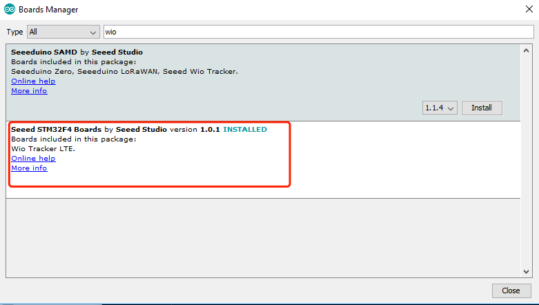

# Wio_Tracker_LTE
Wio Tracker LTE is boards combined with STM32F405RGT6 and quectel EC21(4G/3G/GPS) module.


[Wio LTE AU Version][1]

[Wio LTE EU Version][2]

[Wio LTE US Version][3]

[Wio LTE JP Version][4]


Install USB drive
===

**Windows Users**: Most versions of Windows won't automatically load the built-in driver for USB com ports. You'll have to download ST's USB driver:

Non-Windows XP [Users download version 1.4.0 drivers](http://www.espruino.com/files/stm32_vcp_1.4.0.zip). Unzip the file, run the executable, and then go to ```C:\Program Files (x86)\STMicroelectronics\Software\Virtual comport driver``` in Windows Explorer and double-click either ```dpinst_amd64.exe``` for 64 bit systems, or ```dpinst_x86.exe``` for 32 bit.

Windows XP [Users download version 1.3.1 drivers](http://www.espruino.com/files/stm32_vcp_1.3.1.zip). Unzip the file, run ```VCP_V1.3.1_Setup.exe```, and then go to ```C:\Program Files\STMicroelectronics\Software\Virtual comport driver``` in Windows Explorer and double-click the executable.

**Linux users** to ensure that you have the correct permissions to connect as a normal user you'll need to copy the file [45-espruino.rules](https://github.com/espruino/Espruino/blob/master/misc/45-espruino.rules) to ```/etc/udev/rules.d```, reload rules with ```udevadm control --reload-rules```, and ensure your user is in the plugdev group (you can check by typing ```groups```). You add it by typing ```sudo adduser $USER plugdev``` and then logging out and back in. Arch Linux users need to add their user to ```uucp``` and ```lock``` groups instead.

**Mac OS X and Chromebook Users**: The board will just plug in and work, without drivers!

Change dfu driver
===

**For windows users**: Press and hold BOOT button and connect to computer you will see ***STM32 Device in DFU Mode*** at device manager, this say that you need to use [zadig_xx.exe](./zadig_2.1.2.exe) to change DFU driver from ***STTub30*** to ***WinUSB*** see bellow. <br>


Usage
===
1.Install Arduino IDE. <br>
2.[Install Wio LTE library](https://github.com/Seeed-Studio/Seeed_Platform) <br>
Copy and paste the json URL to Arduino preference

```
https://raw.githubusercontent.com/Seeed-Studio/Seeed_Platform/master/package_seeeduino_boards_index.json
```



3.Download this repo to your Arduino libraries' path. <br>
4.Choose a example to compile. <br>
5.Before connect USB cable to Computer press and hold BOOT button, in order to access ***STM BOOLARDER*** mode. <br>
6.Verify and upload Arduino sketch.<br>

## Go to [**Seeed WiKi**](http://wiki.seeed.cc/Wio_LTE_Cat.1/#play-with-arduino) for getting started.


----
This software is written by Lambor for seeed studio and is licensed under [The MIT License](http://opensource.org/licenses/mit-license.php). Check License.txt for more information.<br>

Contributing to this software is warmly welcomed. You can do this basically by<br>
[forking](https://help.github.com/articles/fork-a-repo), committing modifications and then [pulling requests](https://help.github.com/articles/using-pull-requests) (follow the links above<br>
for operating guide). Adding change log and your contact into file header is encouraged.<br>
Thanks for your contribution.

Seeed is a hardware innovation platform for makers to grow inspirations into differentiating products. By working closely with technology providers of all scale, Seeed provides accessible technologies with quality, speed and supply chain knowledge. When prototypes are ready to iterate, Seeed helps productize 1 to 1,000 pcs using in-house engineering, supply chain management and agile manufacture forces. Seeed also team up with incubators, Chinese tech ecosystem, investors and distribution channels to portal Maker startups beyond.


[](https://github.com/igrigorik/ga-beacon)


[1]:https://www.seeedstudio.com/Wio-LTE-AU-Version--4G%2C-Cat.1%2C-GNSS%2C-Espruino-Compatible-p-2999.html
[2]:https://www.seeedstudio.com/Wio-LTE-EU-Version-4G%2C-Cat.1%2C-GNSS%2C-Espruino-Compatible-p-2998.html
[3]:https://www.seeedstudio.com/Wio-LTE-US-Version-4G%2C-Cat.1%2C-GNSS%2C-JavaScript%28Espruino%29-Compatible-p-2957.html
[4]:https://www.seeedstudio.com/Wio-LTE-JP-Version-4G%2C-Cat.1%2C-Espruino-Compatible-p-3018.html
