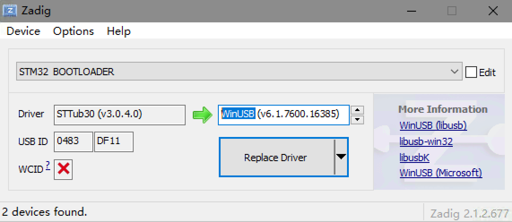

# Wio_Tracker_LTE
Wio Tracker LTE is boards combined with STM32F405RGT6 and EC21(4G/3G/GPS) module.

You can buy Wio Tracker LTE board [here](https://www.seeedstudio.com). <br>

Install USB drive
===

**Windows Users**: Most versions of Windows won't automatically load the built-in driver for USB com ports. You'll have to download ST's USB driver:

Non-Windows XP [Users download version 1.4.0 drivers](http://www.espruino.com/files/stm32_vcp_1.4.0.zip). Unzip the file, run the executable, and then go to ```C:\Program Files (x86)\STMicroelectronics\Software\Virtual comport driver``` in Windows Explorer and double-click either ```dpinst_amd64.exe``` for 64 bit systems, or ```dpinst_x86.exe``` for 32 bit.

Windows XP [Users download version 1.3.1 drivers](http://www.espruino.com/files/stm32_vcp_1.3.1.zip). Unzip the file, run ```VCP_V1.3.1_Setup.exe```, and then go to ```C:\Program Files\STMicroelectronics\Software\Virtual comport driver``` in Windows Explorer and double-click the executable.

**Linux users** to ensure that you have the correct permissions to connect as a normal user you'll need to copy the file [45-espruino.rules](https://github.com/espruino/Espruino/blob/master/misc/45-espruino.rules) to ```/etc/udev/rules.d```, reload rules with ```udevadm control --reload-rules```, and ensure your user is in the plugdev group (you can check by typing ```groups```). You add it by typing ```sudo adduser $USER plugdev``` and then logging out and back in. Arch Linux users need to add their user to ```uucp``` and ```lock``` groups instead.

**Mac OS X and Chromebook Users**: The board will just plug in and work, without drivers!

Change dfu driver
===

**For windows users**: Press and hold BOOT button and connect to computer you will see ***STM32 Device in DFU Mode*** at device manager, this say that you need to use [zadig_xx.exe](./zadig_2.1.2.exe) to change DFU driver from ***STTub30*** to ***WinUSB*** see bellow. <br>



Usage
===
1.Install Arduino IDE. <br>
2.[Install Wio LTE library](https://github.com/Seeed-Studio/Seeed_Platform) <br>
Copy and past the json URL to Arduino preference

```
https://raw.githubusercontent.com/Seeed-Studio/Seeed_Platform/master/package_seeeduino_boards_index.json
```


3.Download this repo to your Arduino libraries' path. <br>
4.Choose a example to compile. <br>
5.Before connect USB cable to Computer press and hold BOOT button, in order to access ***STM BOOLARDER*** mode. <br>
6.Verify and upload Arduino sketch.<br>


